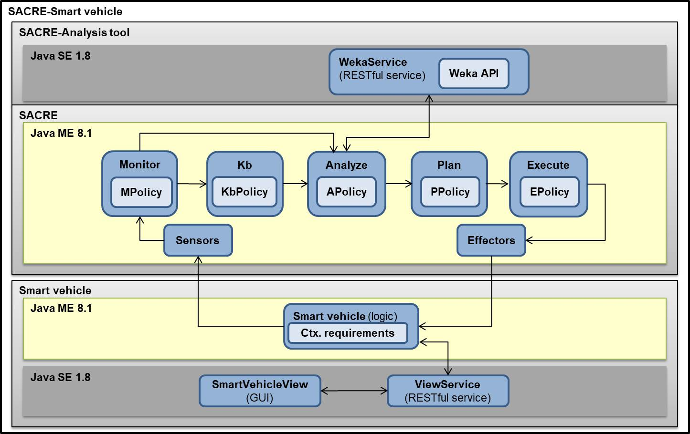

# SACRE (Smart Adaptation through Contextual REquirements)

SACRE is an approach for effectively, efficiently and accurately supporting the adaptation of modern software systems’ contextual requirements in the presence of uncertainty at runtime. In order to perform the adaptation process, SACRE relies on a MAPE-K feedback loop.

This repository contains an implementation of SACRE for the smart vehicles domain. Particularly, the current configuration has been designed for detecting and correctly supporting drowsy drivers. This implementation uses data mining for determining the best operationalization of context at runtime.

### Repository structure:
- SACRE: Java ME implementation of the MAPE-K adaptation feedback loop and the Smart vehicle logic.
- SmartVehicleView: Java SE implementation of the smart vehicle dashboard and the street view window. Alternatively to these components, the view bridge class (SVViewBridge.java) without GUI elements can be used.
- ViewService: RESTful service for communicating the SmartVehicleView with the Smart vehicle logic.
- WekaService: RESTful service in charge of aplying data mining algorithms over monitored data (using the WekaAPI-http://www.cs.waikato.ac.nz/ml/weka/).

The figure below shows the interaction between the components of this repository.

This implementation of SACRE is licensed under the [Apache License, Version 2.0](http://www.apache.org/licenses/LICENSE-2.0)

### Getting started
- Set up your Oracle Java ME environment (Java ME SDK - http://www.oracle.com/technetwork/java/embedded/javame/index.html).

- Clone this repository.

- Build and deploy the ViewService and the WekaService.

- Configure the Smart vehicle view:
  - In sacre-sv/SmartVehicleView/SmartVehicleView/res/panelConfig.properties indicate:
    - The paths to your driver-smart vehicle interaction input files (i.e., files with sensors and actuators simulated data for the different driver's state). You have example files for the tired driver context in sacre-sv/SmartVehicleView/SmartVehicleView/res/.
    - In case of using the GUI, paths to your automatic driving mode simulated data input files (for a straight and with curves road). You have an example file for a straight road in sacre-sv/SmartVehicleView/SmartVehicleView/res/. See the video provided below for more details about this automatic driving mode.
    - The frequency (i.e., interReadingsTime) at which the smart vehicle reads simulated sensors and actuators data.
    - Finally, the driverMood you would like to test.
    
- Configure the Smart vehicle logic:
  - In sacre-sv/SACRE/Autonomic/res/ISmartVehicle.txt and sacre-sv/SACRE/Autonomic/res/IContextualRequirements.txt provide the details of the initil set of contextual requirements (i.e., contexts descriptions and ids, expected behaviors, contexts' operationalizations, etc.). You can use the current configuration for testing SACRE.
  - In sacre-sv/SACRE/Autonomic/res/svUpdate.properties provide the deails of the sensor variables to sense and the frequency (interReadingsTime) at which the smart vehicle logic will request the simulated data to the view service and report it to the SACRE. You can use the current configuration for testing SACRE.
  - In sacre-sv/SACRE/Autonomic/res/contextReqVarsUpdate.properties in case a translation if needed, specify how the resulting data mining rules variables' values are translated into the requirments contexts' operationalization variables' values. You can use the current configuration for testing SACRE.
  
- Configure the Analysis tool (Weka):
  - Weka uses a specific file format and structure as input for its algorithms. Thus in sacre-sv/SACRE/Autonomic/res/wekaPolicy.properties provide the header of the .arff file according to the algorithm and data to be used (this header is used by the SACRE Kb for constructing the corresponding files). You can use the current configuration for testing SACRE.
  
- Configure SACRE:
  - Monitor:
    - In sacre-sv/SACRE/Autonomic/res/monitorPolicy.properties provide information about the variables to monitor and their expected min and max values for detecting anomalies.
    - In case it is needed, in sacre-sv/SACRE/Autonomic/res/sensorsPolicy.properties provide monitoring data pre-processing parameters (e.g., min-max values for noralization). The pre-processing is effectuated by the sensors interface of SACRE. You can use the current configuration for testing SACRE with the provided analysis tool.
  - Analyze:
    - In sacre-sv/SACRE/Autonomic/res/analyzerPolicy.properties speficy the algorithm and tool to be used, the input variables and resulting statistics required from the tool. You can use the current configuration for testing SACRE with the provided analysis tool.
  - Plan:
    - In sacre-sv/SACRE/Autonomic/res/plannerPolicy.properties provide the acceptance thresholds for the analysis statistics. You can use the current configuration for testing SACRE with the provided analysis tool.
  - Knowledge base:
    - In sacre-sv/SACRE/Autonomic/res/kbPolicy.properties set the frequency (interReadingsfTime) at which SACRE will get SV data and the minimum amount of iterations (in which a requirement is affected by uncertainty) to wait before triggering a Symptom.
    - In sacre-sv/SACRE/Autonomic/res/IKB.txt context variables details for persistence purposes. You can use the current configuration for testing SACRE.
  - Execute: Note that in this implementation we have not used an execute policy since SACRE is embedded in the managed element. Execution policies can be used for indicating which adaptations correspond to which managed elements. 
  
- Start the server with the view and weka services. In console you will see services requests and responses.
  
- Run SACRE in the Java ME emulator. In the emulator's console you will see SACRE's output (MAPE-K functioning, symptoms, adaptations, etc.).
  
- Run the smart vehicle view. As mentioned before you can run the GUI components or the bridge class. In case you use the bridge, in console you will see the sensors and actuators reading iterations. We have used the GUI components for demonstrations and the bridge class for testing. 

### Related publications:
- Zavala, E., Franch, X., Marco, J., Knauss, A., & Damian, D. (2015, August). SACRE: A tool for dealing with uncertainty in contextual requirements at runtime. In Requirements Engineering Conference (RE), 2015 IEEE 23rd International (pp. 278-279). IEEE. (Previous version)

- Zavala, E., Franch, X., Marco, J., Knauss, A., & Damian, D. (2018). SACRE: Supporting contextual requirements’ adaptation in modern self-adaptive systems in the presence of uncertainty at runtime. Expert Systems with Applications.

### Videos:
- https://www.youtube.com/watch?v=6iBlvbpJ29w (Previous version with GUI components)

**Main contact:** Edith Zavala <zavala@essi.upc.edu>
